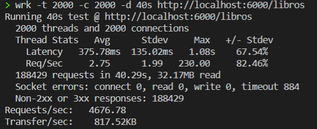
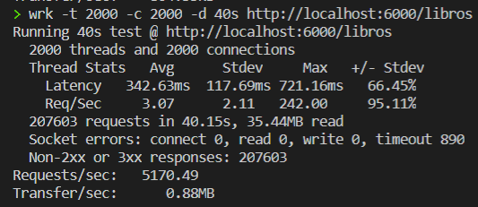

# BLIOTEC

[](https://travis-ci.com/fer227/BLIOTEC) [](https://circleci.com/gh/fer227/BLIOTEC) [](https://ci.appveyor.com/project/fer227/bliotec)

BLIOTEC consiste en un proyecto orientado a la computación en la nube que pretende organizar y gestionar el catálogo de libros de una biblioteca, además de los préstamos con los clientes de la misma.

Para probarlo, primero clona el repositorio e instala nuestro gestor de tareas (para a su vez instalar las dependencias y probar el proyecto).

```
git clone https://github.com/fer227/BLIOTEC
npm install -g gulp
npm install -g gulp run
gulp install
gulp test
```

En el directorio [doc](./doc) se puede observar las diferentes fases del avance del proyecto.

# Microservicios

## Elección del framework
Para crear un microservicio necesitaremos crear una serie de rutas que den respuesta a las necesidades de los clientes. Los frameworks nos facilitarán la construcción de las mismas. Para el lenguaje que estamos utilizando en nuestro proyecto existen multitud de frameworks, aunque el funcionamiento de los mismos es bastante similar en todos ellos.

El más estandarizado y con más soporte es *Express*. De hecho, la mayoría del resto de frameworks intenta imitar su filosofía. Por otro lado, también es cierto que al ser un framework tan completo, hace que dependa de muchos módulos y sea un tanto [pesado](https://medium.com/sharenowtech/there-are-expressjs-alternatives-590d14c58c1c). 

Es por esto que he decido fijarme en otro tipo de frameworks, más "ligeros" y minimalistas (también se conocen como microframeworks) que probablemente tengan un buen rendimiento. También porque el único que he probado previamente es Express y me gustaría probar otros diferentes.

Los dos framework que se han probado han sido *Polka* y *Koa*. Para ambos, implementamos las rutas del controlador de libros para ver su sintaxis y funcionamiento.

- **Polka**. En el estado del proyecto de este [commit](https://github.com/fer227/BLIOTEC/tree/05d79c0652b408a1eb72e96afd119b334f667e1b), concretamente en el [index.js](https://github.com/fer227/BLIOTEC/blob/05d79c0652b408a1eb72e96afd119b334f667e1b/index.js) se puede ver como se implementaron algunas rutas del controlador de libros. La documentación de este framework se puede ver [aquí](https://github.com/lukeed/polka).
- **Koa**. Para comparar con el anterior, se realizó la misma tarea que se puede observar en el estado del proyecto de este [commit](https://github.com/fer227/BLIOTEC/tree/bda29334409e7eda90bba459f77e780ccabe69e9) y concretamente en su [index.js](https://github.com/fer227/BLIOTEC/blob/bda29334409e7eda90bba459f77e780ccabe69e9/index.js). La documentación de este framework se puede ver [aquí](https://github.com/koajs/koa).

### Diferencias
- Con respecto al formato de las peticiones y respuestas, *Polka* sigue la sintaxis de Express teniendo un objeto con la información de la petición y otro para la respuesta que podemos modificar (req, res). En el caso de Koa, lo tenemos todo englobado en un objeto que se conoce como el "contexto" (ctx).
- Podemos observar que en Polka no existe una diferenciación entre el *router* que gestiona las rutas y la aplicación o servidor (las rutas cuelgan directamente de la aplicación). En el caso de Koa, si tenemos un módulo (no viene en el *core* del framework) para crear un *router* y gestionar las rutas.
- En el *router* de Koa, contamos con un método *allowedMethods()* que permitirá a la aplicación detectar qué métodos y qué rutas están definidas para lanzar el error correspondiente en caso de que el cliente se salga de las rutas establecidas.
- En general, Koa tiene más soporte (pues tiene una mayor comunidad) y cuenta con *plugins* (body-parsers, json, loggers...) específicos para el framework, cosa que no ocurre en Polka.
- En cuanto al rendimiento, se han hecho unas pequeñas pruebas de benchmarking mediante la herramienta *wrk*. En general, el rendimiento de ambos fue bastante parecido en las ejecuciones llevadas a cabo. A continuación mostramos un ejemplo.
    - Koa:
        - 
    - Polka:
        - 

### Conclusiones y elección
**Polka** es un microframework que nos permite desarrollar aplicaciones de forma muy rápida debido a su diseño minimalista. En su documentación, también lo comparan en Benchmarks con otros frameworks (como Koa y Express) y aparece como el más eficiente.

Sin embargo, creo que la diferenciación del *router* con la aplicación, el soporte mediante plugins, la mayor comunidad y en general el funcionamiento de **Koa** lo hacen una opción más completa e interesante para nuestro proyecto.

## Diseño de la API REST
A continuación indico para cada historia de usuario, qué rutas (método utilizado, la ruta entre paréntesis y/o parámetros, los cuales se especifican al final de la ruta precedido de ':') se han desarrollado y cuáles son las posibles respuestas.

### Libros

- [HU1 Consulta de libros](https://github.com/fer227/BLIOTEC/issues/7). 

    - get('/libros/'). La respuesta siempre es 200.
    - get('/libros/:id'). La respuesta es 200 si el *id* es correcto, 404 en caso de no existir.

- [HU2 Gestión del catálogo](https://github.com/fer227/BLIOTEC/issues/8). 
    - post('/libros/'). Los parámetros del libro van el body. La respuesta será 201 si se creó correctamente, 400 si los parámetros no son correctos o 409 si ya existe el identificador.
    - delete('/libros/:id'). La respuesta es 200 si se eliminó correctamente o 404 si el identificador no existe.

- [HU9 Obtener libros por filtros](https://github.com/fer227/BLIOTEC/issues/15).
    - get('/libros/genero/:id'). El *id* identifica al género. Se obtiene un 200 si todo fue correctamente o un 400 en caso de que el género no sea correcto.

- [HU13 Valoraciones de libros](https://github.com/fer227/BLIOTEC/issues/22).
    - get('/valoraciones/:isbn'). Obtenemos las valoraciones de un libro (según su ISBN). La respuesta siempre es 200.
    - post('/valoraciones/'). Los parámetros van en el body. Obtendremos un 201 si se añadió correctamente o un 400 si los parámetros no son correctos.

Las rutas de los libros se pueden ver en este [fichero](./routes/libros.js).

### Préstamos

- [HU4 Poder hacer un préstamo](https://github.com/fer227/BLIOTEC/issues/10).
    - post('/prestamos/'). Los parámetros del préstamo van en el body. Obtendremos un 201 si se creó correctamente, 409 si ya existe el identificador o 400 si los parámetros no son correctos.
    - get('/prestamos/:id'). Obtenemos un 404 si el identificador del préstamo no existe o un 200 en caso contrario.

- [HU5 Devolver un libro](https://github.com/fer227/BLIOTEC/issues/11).
    - put('/prestamos/devolver/:id'). Se obtiene un 200 si la operación tuvo éxito o un 404 en caso de que el identificador no exista.

- [HU7 Renovar un préstamo](https://github.com/fer227/BLIOTEC/issues/13).
    - put('/prestamos/renovar/:id'). Devuelve un 200 si la operación tuvo éxito o un 404 en caso de que el identificador no exista.

- [HU12 Saber los préstamos caducados](https://github.com/fer227/BLIOTEC/issues/18).
    - get('/prestamos/status/vencidos'). Siempre se obtiene un 200.

Las rutas de los préstamos se pueden encontrar [aquí](./routes/prestamos.js).

### Usuarios

- [HU3 Usuario quiere registrarse](https://github.com/fer227/BLIOTEC/issues/9).
    - post('/usuarios/'). Los parámetros del usuario van en el body. Obtenemos un 201 si se creó correctamente, un 400 si los parámetros no son correctos o un 409 si el *username* ya existe.

- [HU8 Administrador quiere consultar datos de usuarios](https://github.com/fer227/BLIOTEC/issues/14).
    - get('/usuarios/:username'). Si el *username* es correcto, obtendremos un 200. En caso contrario, un 404.

Las rutas de los usuarios las puedes encontrar [aquí](./routes/usuarios.js).