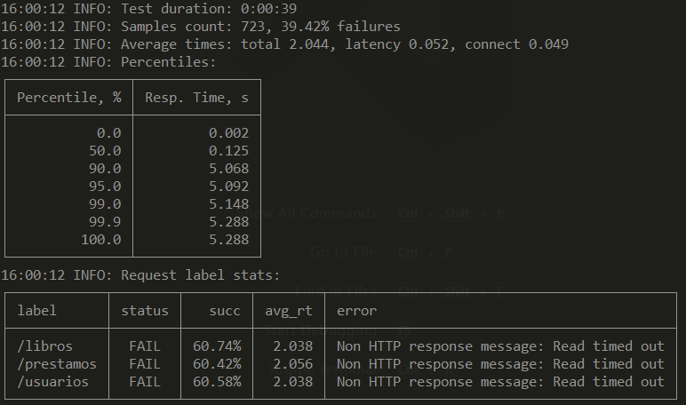
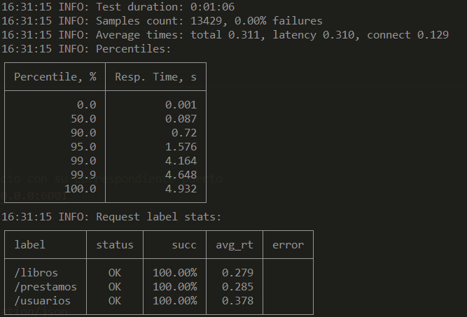
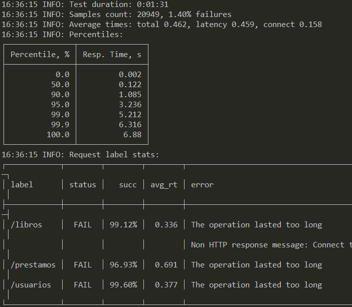

# BLIOTEC

[](https://travis-ci.com/fer227/BLIOTEC) [](https://circleci.com/gh/fer227/BLIOTEC) [](https://ci.appveyor.com/project/fer227/bliotec)

BLIOTEC consiste en un proyecto orientado a la computación en la nube que pretende organizar y gestionar el catálogo de libros de una biblioteca, además de los préstamos con los clientes de la misma.

Para probarlo, primero clona el repositorio e instala nuestro gestor de tareas (para a su vez instalar las dependencias y probar el proyecto).

```
git clone https://github.com/fer227/BLIOTEC
npm install -g gulp gulp-run
gulp install
gulp test
```

En el directorio [doc](./doc) se puede observar las diferentes fases del avance del proyecto.

# Composición de servicios

## Estructura escogida
Puesto que tenemos tres entidades bastante independientes (libros, préstamos y usuarios), seguiremos nuestra idea del principio de dividir el sistema en tres microservicios. Cada entidad dispone de su controlador y sus propias rutas. 

Necesitaremos crear tres ficheros "index" que lancen los servicios, introducir cada servicio en una imagen y coordinarlos mediante docker-compose.

## Microservicios y contenedores
Para cada contenedor son muy importantes los siguientes aspectos:
- Copiar solos los archivos que nos sean **necesarios**.
- Respetar la estructura de directorios para que los **require** sigan funcionando.
- Reservar un **puerto** exclusivo para el microservicio.
- Instalar solo las dependencias neceserias (es decir, de **producción**).
- Como para todos los microservicios vamos a utilizar las mismas herramientas, no hace falta que especifiquemos nuevos archivos de dependencias. Las dependencias de producción de los microservicios (incluidas en el *package.json*) se muestran a continuación.

```
"dependencies": {
    "@koa/router": "^10.0.0",
    "dotenv": "^8.2.0",
    "etcd3": "^1.1.0",
    "koa": "^2.13.1",
    "koa-bodyparser": "^4.3.0",
    "koa-json": "^2.0.2",
    "koa-pino-logger": "^3.0.0",
    "gulp": "^4.0.2",
    "gulp-run": "^1.7.0"
  }
```

Para cada microservicio, hemos creado una nueva carpeta con su **index.js** y **.env** correspondiente:
- [libros_service](./libros_service) 
- [prestamos_service](./prestamos_service)
- [usuarios_service](./usuarios_service)

Los tres microservicios se han llevado a cabo de forma muy similar, así que nos centraremos en explicar el microservicio de libros.

En los *.env* hemos indicado los puertos de cada microservicio, siendo el **6001** para el microservicio de los libros, **6002** para el de los préstamos y **6003** para el de los usuarios.

Como hemos avanzado anteriormente, en cada *index* lanzamos el microservicio. Es bastante similar al index que venimos utilizando. Las diferencias más relevantes son:
- Incluímos **solo** el fichero de rutas que corresponde al microservicio ([línea 7](./libros_service/index.js)). 
- En el *etcd*, cada microservicio tendrá una **clave** diferente para recoger su puerto ([línea 31](./libros_service/index.js)).

Vamos a pasar a analizar como he construido la imagen de los microservicios. A continuación se muestra el código (con comentarios explicativos) del Dockerfile para el microservicio de libros.

```
# Continuamos con la imagen que venimos utilizando en mis Dockerfiles
FROM node:14-alpine3.10
LABEL maintainer ="Fernando Izquierdo Romera <fer227@correo.ugr.es>" \
        com.bliotec.version="4.0.0" \
        com.bliotec.release-date="2021-01-11" \
        com.bliotec.repository="https://github.com/fer227/BLIOTEC"

# Creamos algunos directorios que vamos a utilizar
# node_modules para las dependencias
# /src/libros para respetar la estructura de directorios que ya tenemos
# Luego les ponemos como propietario al usuario node, que es el que utilizaremos y que tiene los permisos justos
RUN mkdir /home/node/node_modules && mkdir -p /home/node/src/libros && chown -R node:node /home/node/node_modules

# Vamos a trabajar directamente en el directorio del usuario node. He visto que algunos sistemas de integración
# continua (como Circleci) cuando abren la imagen de Docker Hub se sitúan en ese directorio
WORKDIR /home/node

# Copio los archivos JUSTOS y necesarios para que funcione el microservicio
# El archivo de dependencias y el del gestor de tareas
COPY --chown=node  package*.json gulpfile.js ./

# El index con la aplicación de Koa además del .env que contiene el puerto
COPY --chown=node  ./libros_service/* ./

# El manejador de excepciones y las rutas del microservicio de libros. Cabe destacar que tenemos que respetar
# la estructura de directorios que ya teníamos para que los "includes" no fallen
COPY --chown=node  ./routes/exceptionHandler.js ./routes/libros.js ./routes/

# El código principal de los libros (clases y controlador) y mi módelo de excepción 
COPY --chown=node  ./src/libros ./src/libros
COPY --chown=node  ./src/exception ./src/exception

# Instalamos nuestro gestor de tareas, lo "linkamos" e instalamos un plugin de gulp que también necesitamos para
# lanzar las tareas
RUN npm install -g gulp-cli && npm link gulp && npm install gulp-run

USER node

# Instalamos las dependencias SOLO de producción
RUN gulp install-production

# Actualizamos la variable PATH
ENV PATH=/app/node_modules/.bin:$PATH

# El puerto que utilizaremos
EXPOSE 6001

# Lanzamos el servicio
CMD ["gulp", "run"]
```

En consecuencia, tenemos tres Dockerfiles (muy similares), situados en la raíz del proyecto:
- [libros.Dockerfile](./libros.Dockerfile)
- [prestamos.Dockerfile](./prestamos.Dockerfile)
- [usuarios.Dockerfile](./usuarios.Dockerfile)

## Docker-Compose
A continuación se muestra mi docker-compose (con comentarios). El objetivo es lanzar los tres microservicios y una red para la comunicación si fuera necesaria. 

```
version: '3'
# Declaramos los tres servicios
services:
  # Microservicio de libros
  libros:
    # Nombre del contenedor
    container_name: libros 
    # Ubicación del Dockerfile. En "context" indicamos el directorio y en "dockerfile" el nombre del mismo
    build: 
      context: .
      dockerfile: libros.Dockerfile
    # Abrimos los puertos
    ports:
         - "6001:6001"
    # Red para comunicación entre microservicios
    networks: 
      - bliotecNetwork

  # Microservicio de préstamos
  prestamos:
    container_name: prestamos
    build: 
      context: .
      dockerfile: prestamos.Dockerfile
    ports:
         - "6002:6002"
    networks: 
      - bliotecNetwork

  # Microservicio de usuarios
  usuarios:
    container_name: usuarios
    build: 
      context: .
      dockerfile: usuarios.Dockerfile
    ports:
         - "6003:6003"
    networks: 
      - bliotecNetwork

# Creación de la red de comunicación
networks:
  bliotecNetwork:
    #Todos los contenedores en una misma red
    driver: bridge
```

## Test en Integración Continua
El sistema de integración continua elegido para comprobar que se lanzan los microservicios correctamente es **Travis**. El archivo de configuración queda como sigue:

```
language: node_js
node_js:
  - 14
  - 15

services:
  - docker

before_install:
  - npm install -g gulp-cli
  - docker-compose build

install:
  - npm install gulp-run
  - gulp install

before_script:
  - docker-compose up -d

script:
  - gulp test
  - curl --location --request GET 'http://localhost:6001/libros/'
  - curl --location --request GET 'http://localhost:6002/prestamos/'
  - curl --location --request GET 'http://localhost:6003/usuarios/'
```

- He eliminado una versión del lenguaje de las tres que testeábamos (concretamente la 12) para ahorrar créditos pues consumía bastante tiempo.
- Lanzamos en *before_install* el `docker-compose build`.
- Mediante peticiones *curl* comprobamos que los servicios están activos.
- El lanzamiento de los microservicios se ha llevado a cabo en una fase previa a la fase de *script* (concretamente *before_script*) debido a que si los levantamos en la misma fase que en la que se prueban, puede ser que lance la petición antes de que esté activo el servicio y dar error.

## Test de rendimiento
Como en ocasiones anteriores hemos llevado a cabo tests de rendimiento mediante la herramienta *wrk*, en esta ocasión, lo haremos con **Taurus**.

Para ello, tenemos que crear un archivo [taurus.yml](./taurus.yml) indicando cómo queremos hacer el test. Normalmente tendremos que establecer en número de usuarios concurrentes y el tiempo del test (entre otros, se puede ver en el archivo).

El primer test que llevé a cabo era bastante leve, con tan solo 25 usuarios y 15 segundos y para mi sorpresa me encontré que el servicio estaba respondiendo más lento de lo que debía:



Como se puede observar, apenas consigue superar el 60% de las peticiones en cada microservicio. Después de estar bastante tiempo buscando y probando, encontré que el problema era el gestor de tareas (**gulp**). Por razones que aún desconozco, si lanzo los microservicios (en sus respectivos Dockerfiles) mediante el gestor de tareas, es decir, `CMD[ "gulp", "run"]` (que internamente llama a `node index.js`) el rendimiento del microservicio no es el que debería. También probé a que gulp llamara internamente a `npm run start`, pero sin éxito.

En consecuencia opté por lanzar los microservicios directamente con node: `CMD [ "node", "index.js" ]`. De esta forma, ya obtenemos un rendimiento óptimo (en el caso de 25 usuarios, el 100% de respuestas correctas).

Probando con varios parámetros, encontré que el *break point* (donde empiezan a fallar algunas peticiones) aproximado está en 180 usuarios (ejecutados durante 45 segundos). La imagen de a continuación es el resultado de ese test exitoso.



Finalmente quise probar a los microservicios con una carga mayor (que es el test que se muestra actualmente en el [taurus.yml](./taurus.yml)) con 1000 para cada microservicio usuarios y 45 segundos de duración. Los resultados son bastante satisfactorios:



## Correcciones

### Logger mediante Middleware
El siguiente *middleware* se encarga de "loggear" toda las peticiones que llegan a la API (y así nos ahorramos bastantes líneas de código, pues anteriormente lo hacía "a mano"). El *Middleware* se muestra a continuación:

```
app.use(async (ctx, next) => {
    await next();
    if((ctx.status !== 200) && (ctx.status !== 201)){
        ctx.log.error(JSON.parse(ctx.body).msg);
    }
    else{
        ctx.log.info(JSON.parse(ctx.body).msg);
    }
})
```

Como se puede observar, es una función asíncrona que contiene un `await next();`. El Middleware se detiene en esa línea, esperando a que termine el siguiente *Middleware* si lo hubiera o directamente la petición en la API. Cuando el resto haya terminado, entonces la función se retoma. Es en ese momento (y no antes, por eso bloqueamos mediante el *await*) cuando puedo saber si la operación ha sido o no exitosa mediante el contexto de la petición (el famoso objecto **ctx**), que contiene el *status*. Incluso podemos incluir el mensaje que va en el *body* de la respuesta.

Este Middleware se define en el *index* de los microservicios.

## Issues en los que he trabajado
- [La ruta "valoraciones" debería incluir el URI del libro al que se refieren](https://github.com/fer227/BLIOTEC/issues/48).
- [Loggear mediante Middleware](https://github.com/fer227/BLIOTEC/issues/49).
- [Separar servicios y lanzarlos con docker-compose](https://github.com/fer227/BLIOTEC/issues/50).
- [Dockerizar cada microservicio](https://github.com/fer227/BLIOTEC/issues/51).
- [Las rutas no pueden terminar en "/"](https://github.com/fer227/BLIOTEC/issues/53).
- [Testear la composición de servicios en algún sistema de ci (y rendimiento)](https://github.com/fer227/BLIOTEC/issues/52).