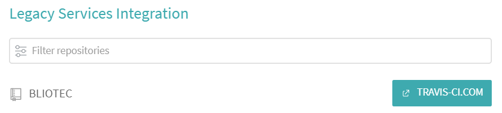
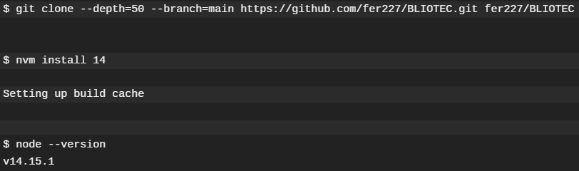
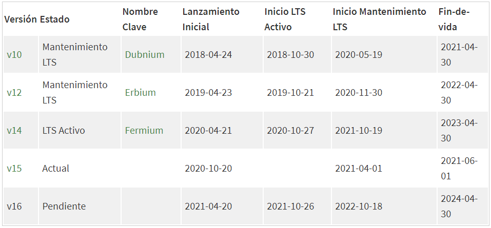

# BLIOTEC

[](https://travis-ci.com/fer227/BLIOTEC) [](https://circleci.com/gh/fer227/BLIOTEC)

## Sistemas de integración continua

Utilizaremos dos sistemas de integración continua:

- **Travis CI**. Probaremos los test en los lenguajes que consideremos oportunos.
- **CircleCI**. Probaremos los test en nuestra imagen de Docker Hub.

### Travis CI
Una vez autorizamos a Travis para acceder a nuestro repositorio, tenemos que seleccionarlo para que se active con cada *push*. En mi caso, tuve que migrar el repositorio de travis-ci.org a travis-ci.com. 



#### **Primera versión**

Travis funciona con "muy poco". Mi script inicial era el siguiente.

```
language: node_js
node_js:
  - 14
```

Solo especificando el lenguaje, en nuestro caso Node.js, Travis sabe como lanzar los test de la siguiente forma. Si observamos los logs, vemos que lo primero que hace es clonar nuestro repositorio e instalar la versión del lenguaje que le hemos indicado.



A continuación, utiliza la herramienta de gestor de dependencias (npm) para instalar las mismas e incluso lanza los test automáticamente.


#### **Versión actualizada**
Anteriormente hemos comentado que utilizaremos Travis para lanzar los test en diferentes versiones del lenguaje. Echémosle un vistazo a los lenguajes en la página oficial.



- La versión 10 es relativamente antigua y le queda poco tiempo de soporte, así la descartamos.
- La versión 16 es bastante reciente y de hecho aún no ha sido lanzada oficialmente, así que también la apartamos.
- La versión 14 es la que utilizamos en nuestro proyecto y además es la LTS activa. Por tanto, la incluimos.
- Puesto que a la versión 12 aún le queda bastante tiempo de mantenimiento y la versión 15 es la más actual, también las probaremos con Travis.

El archivo de configuracción final del proyecto se muestra a continuación:

```
language: node_js
node_js:
  - 12
  - 14
  - 15

before_install:
  - npm install -g gulp-cli gulp-run

script:
  - gulp install
  - gulp test
```

Paso a paso:

1. Especificamos los tres lenguajes a probar.
2. Previamente instalamos el cliente de Gulp (nuestro gestor de tareas) y gulp-run (una librería que uso en Gulp para lanzar tareas).
3. Mediante el gestor de tareas, instalamos las dependencias y posteriormente los test.

Actualmente los test funcionan correctamente (se puede comprobar con el badge situado al inicio del readme).