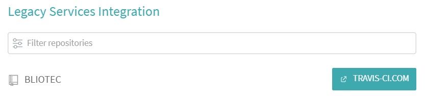
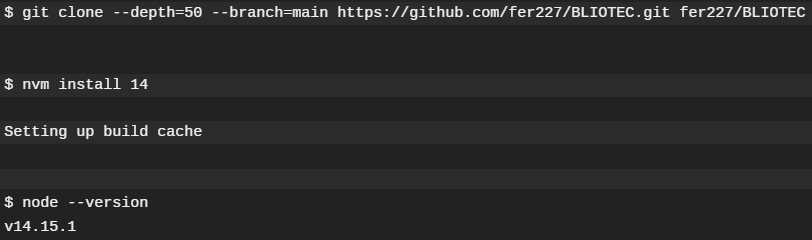
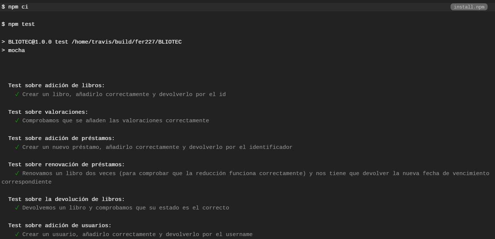
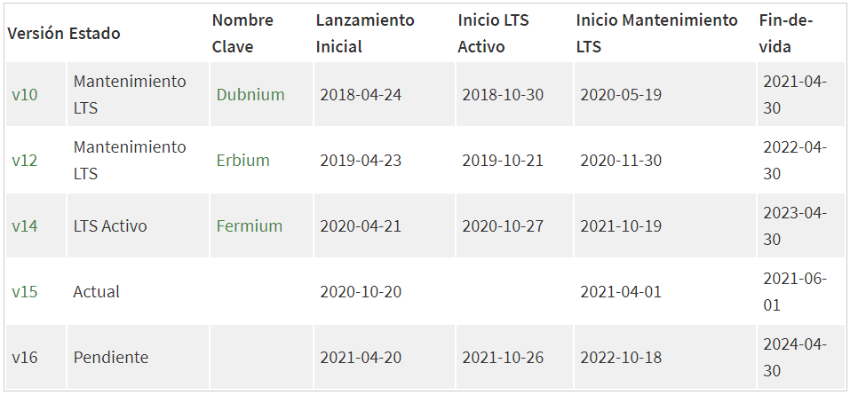
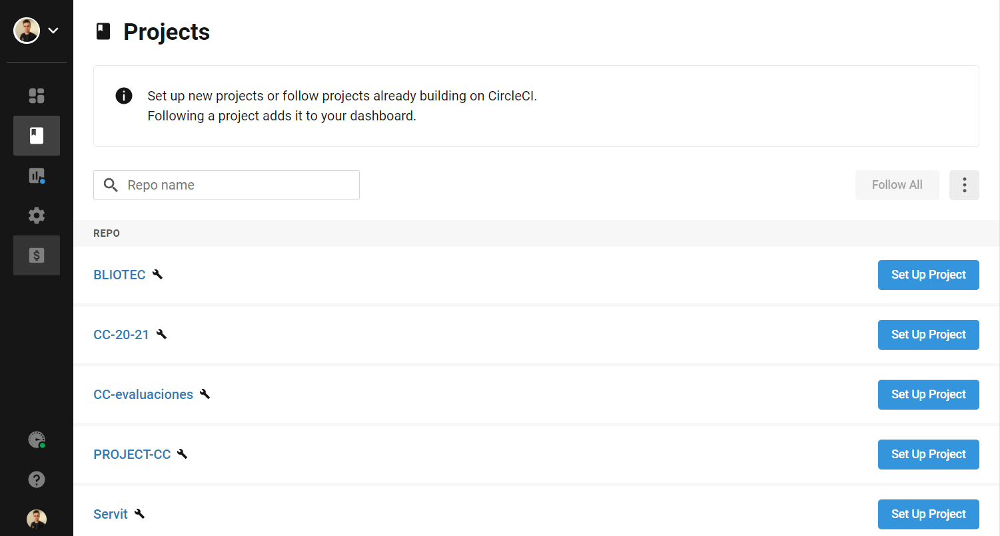
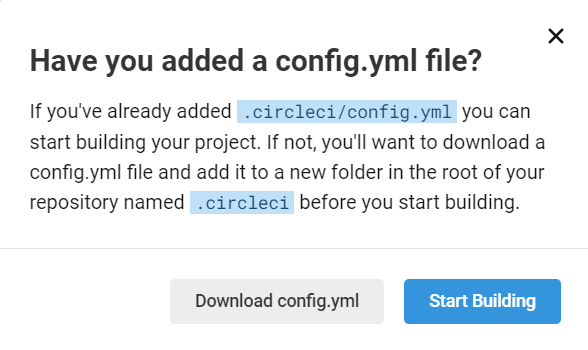
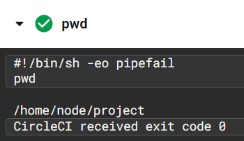
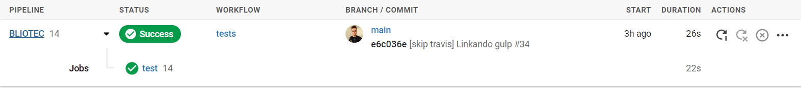
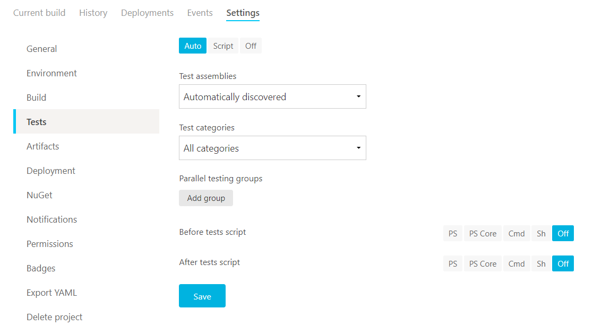
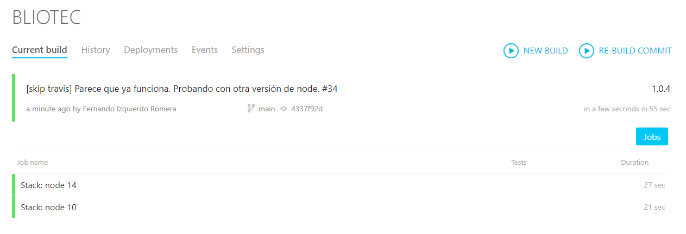

## Sistemas de integración continua

Utilizaremos dos sistemas de integración continua:

- **Travis CI**. Probaremos los test en los lenguajes que consideremos oportunos.
- **CircleCI**. Probaremos los test en nuestra imagen de Docker Hub.
- De forma adicional, probaremos **AppVeyor**.

### Travis CI
Una vez autorizamos a Travis para acceder a nuestro repositorio, tenemos que seleccionarlo para que se active con cada *push*. En mi caso, tuve que migrar el repositorio de travis-ci.org a travis-ci.com. 



#### **Primera versión**

Travis funciona con "muy poco". Mi script inicial era el siguiente.

```
language: node_js
node_js:
  - 14
```

Solo especificando el lenguaje, en nuestro caso Node.js, Travis sabe como lanzar los test de la siguiente forma. Si observamos los logs, vemos que lo primero que hace es clonar nuestro repositorio e instalar la versión del lenguaje que le hemos indicado.



A continuación, utiliza la herramienta de gestor de dependencias (npm) para instalar las mismas e incluso lanza los test automáticamente.



#### **Versión actualizada**
Anteriormente hemos comentado que utilizaremos Travis para lanzar los test en diferentes versiones del lenguaje. Echémosle un vistazo a los lenguajes en la página oficial.



- La versión 10 es relativamente antigua y le queda poco tiempo de soporte, así la descartamos.
- La versión 16 es bastante reciente y de hecho aún no ha sido lanzada oficialmente, así que también la apartamos.
- La versión 14 es la que utilizamos en nuestro proyecto y además es la LTS activa. Por tanto, la incluimos.
- Puesto que a la versión 12 aún le queda bastante tiempo de mantenimiento y la versión 15 es la más actual, también las probaremos con Travis.

El archivo de configuracción final del proyecto se muestra a continuación ([link](../.travis.yml) al script).:

```
language: node_js
node_js:
  - 12
  - 14
  - 15

before_install:
  - npm install -g gulp-cli gulp-run

script:
  - gulp install
  - gulp test
```

Paso a paso:

1. Especificamos los tres lenguajes a probar.
2. Previamente instalamos el cliente de Gulp (nuestro gestor de tareas) y gulp-run (una librería que uso en Gulp para lanzar tareas).
3. Mediante el gestor de tareas, instalamos las dependencias y posteriormente los test.

Actualmente los test funcionan correctamente (se puede comprobar con el badge situado al inicio del readme).

### CircleCI
Una vez que nos damos de alta mediante la cuenta de Github, veremos en la pantalla principal nuestros repositorios y podemos activarlos pinchando sobre *Set Up Project*.



CircleCI es capaz de detectar el lenguaje que usamos y recomendarnos una configuración por defecto.



Como nosotros nos vamos a centrar en testear sobre nuestro contenedor, vamos a pasar directamente a él. La configuración utilizada en este sistema de integración se muestra a continuación ([link](../.circleci/config.yml) al script).

```
version: 2.1
jobs:
  test:
    docker:
      - image: fer227/bliotec:latest
    steps:
      - run: cp -R /app/node_modules ./node_modules
      - run: npm link gulp
      - run: gulp test
workflows:
  tests:
    jobs:
      - test
```

 1. Seleccionamos nuestra imagen de Docker Hub.
 2. Copiamos las dependencias al directorio actual.
 3. Enlazamos gulp (tenemos que hacerlo pues hemos cambiado la ubicación de las dependencias).
 4. Lanzamos los test.

 El motivo por el cual tenemos que cambiar las dependencias de directorio es porque cuando utilizamos el usuario de *Node* (como se hace en el Dockerfile), CircleCI copia nuestro repositorio en el *home* de este usuario, mientras que las dependencias del proyecto se encuentran en */app* (pues así lo hicimos en el Dockerfile). Esto lo conseguí averiguar ejecutando la orden *pwd* en archivos de configuraciones previos al correcto.


 
 De igual forma, podríamos haber modificado nuestra imagen Docker y trabajar directamente en el *Home* del usuario *Node*.

 Finalmente podemos comprobar que los test pasan con éxito. (También disponemos del *badge* de CircleCI al inicio del readme).

 


 ### AppVeyor
El último sistema de integración continua que vamos a probar es AppVeyor. El proceso de ingreso es el mismo que en los sistemas anteriores (mediante GitHub). Me llamó la atención que podemos configurar como queremos la integración continua desde los ajustes del proyecto en la web de AppVeyor mediante una interfaz de usuario:

 

 De todas formas, nosotros lo configuraremos mediante script, el cual se muestra a continuación ([link](./appveyor.yml) al script).

 ```
image: Ubuntu
stack:
  - node 14
  - node 10
install:
  - npm install -g glup-cli gulp-run
  - gulp install
build: off
test_script:
  - gulp test
 ```

 Como podemos observar, la estructura del script es muy similar a los mostrados anteriormente.
 
 1. Como imagen he seleccionado Ubuntu. AppVeyor también cuenta con imágenes para Windows y macOS.
 2. En stack seleccionamos las versiones del lenguaje que queremos testear. Probamos la 14 que hemos venido utilizando y de forma adicional la 10 que no la hemos probado en ninguno de los sistemas anteriores (es una versión antigua pero sigue teniendo soporte).
3. Instalamos el gestor de tareas e instalamos las dependencias.
4. Indicamos que no queremos construir, solo testear.
5. Llamamos a los test.

El resultado es satisfactorio:

 

 También contamos con un *badge* al inicio del readme con el estado de los test en AppVeyor.
