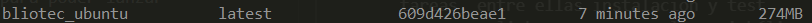
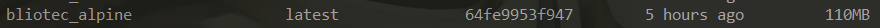
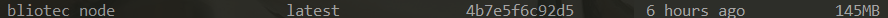

# Justificación del Dockerfile
En este apartado intentaremos justificar la imagen finalmente escogida para llevar a cabo la Docker de nuestro proyecto. También veremos los diferentes Dockerfiles que se han probado y sus estructuras.

## Imágenes
Las posibilidades para escoger una imagen en nuestro Dockerfile son muy variadas. Todos las distribuciones tienen imágenes para Docker (Fedora, CentOS, Ubuntu..) e incluso cada una de ellas tienen diferentes versiones. Por otro lado, también nos encontramos con imágenes oficiales de los diferentes lenguajes de programación que ya los traen instalados y listos para utilizarse. Finalmente me he decantado por las siguientes opciones:

-  Puede ser interesante probar una distribución con una instalación "completa" como por ejemplo Ubuntu, uno de los SO más utilizados y con mayor soporte de los que existen actualmente. De entre las [opciones](https://hub.docker.com/_/ubuntu) que nos proporciona Ubuntu, hemos elegido la versión **Focal**.

- También tenemos la opción de probar una imagen "ligera" que traiga lo suficiente para funcionar y en ella nosotros instalamos lo que veamos necesario para nuestro proyecto. Esto nos proporcionará un docker con un peso muy reducido y optimizado. [Alpine](https://hub.docker.com/_/alpine) parece ser la más estandarizada en este sentido.

- Finalmente, creo que sería conveniente probar una imagen oficial del lenguaje que estamos utilizando ([Node.js](https://hub.docker.com/_/node)). Cuenta con múltiples imágenes para diferentes sistemas operativos y a su vez, para las diferentes versiones del lenguaje. Como estamos intentado optimizar el contenedor, utilizaremos la versión de **Alpine** para la versión **14.15** del lenguaje (que se corresponde con la última versión LTS).

A continuación probamos los diferentes Dockerfiles que he llevado a cabo para estas imágenes.

## Pruebas con las diferentes imágenes
En general, los pasos que he seguido en los diferentes Dockerfiles son muy similares. Esta podría ser la estructura:

1. Creación de un usuario con permisos básicos (si es necesario).
2. Creación de la estructura de directorios.
3. Instalación del lenguaje (si es necesario).
4. Instalación de las dependencias.
5. Lanzar los test.

Cada imagen, aunque sigue el esquema anterior, tiene sus peculiaridades que veremos a continuación.

### Ubuntu
En ubuntu necesitaremos crear un usuario básico e instalar el lenguaje. El Dockerfile resultante es el siguiente:

```
FROM ubuntu:focal
LABEL maintainer ="Fernando Izquierdo Romera <fer227@correo.ugr.es>" \
        com.bliotec.version="4.0.0" \
        com.bliotec.release-date="2020-11-21" \
        com.bliotec.repository="https://github.com/fer227/BLIOTEC"


# Creamos un usuario con permisos básicos y la estructura de directorios que necesitamos
# Indicamos que el propietario de esos directorios es el nuevo usuario que hemos creado
# Instalamos la versión que estamos utilizando de Node (la última LTS, que se corresponde con la 14) y para ello necesitamos curl
# Una vez lo hemos instalado, ya podemos eliminar curl pues no lo vamos a necesitar
RUN useradd -m usuario && mkdir -p /app/test/node_modules \
        && chown -R usuario /app \
        && apt-get update && apt-get install curl -y\
        && curl -sL https://deb.nodesource.com/setup_14.x | bash - \
        && apt-get install -y nodejs \
        && apt-get remove --auto-remove curl -y

# Cambiamos al directorio que hemos creado
WORKDIR /app/test

# Copiamos los archivos de dependencias y ponemos como propietario al usuario que hemos creado
COPY --chown=usuario package*.json gulpfile.js ./

# Instalamos el cliente de gulp (en global) para poder lanzar tareas, entre ellas instalación y test
# Con npm link creamos un enlace simbólico para que lo detecte en node_modules y así podamos utilizarlo
# Finalmente instalamos el módulo de gulp run (en local) puesto que lo utilizamos en nuestro task manager para lanzar tareas
RUN npm install -g gulp-cli && npm link gulp && npm install gulp-run

# Cambiamos al usuario node para no tener privilegios
USER usuario

# Instalamos las dependencias
RUN gulp install

# Lanzamos los test
CMD ["gulp", "test"]
```

Una vez creado y probado, vemos el tamaño del contenedor:



Como era de esperar, el contendor tiene un tamaño considerable.

### Alpine
La estructura de nuestro Dockerfile en Alpine en muy similar al de Ubuntu, solo cambia la forma de instalar el lenguaje:

```
FROM alpine:latest
LABEL maintainer ="Fernando Izquierdo Romera <fer227@correo.ugr.es>" \
        com.bliotec.version="4.0.0" \
        com.bliotec.release-date="2020-11-21" \
        com.bliotec.repository="https://github.com/fer227/BLIOTEC"


# Creamos un usuario básico sin permisos de superusuario
# Creamos la estructura de directorios e indicamos que el propietario es el nuevo usuario que hemos creado
# Instalamos nodejs (por defecto instala la última LTS, que sería la 14) y npm. 
RUN     addgroup bliotec \
        && adduser -G bliotec -S usuario \
        && mkdir -p /app/test/node_modules \
        && chown -R usuario /app \
        && apk add --update nodejs-current nodejs-npm

# Cambiamos a nuestro directorio de trabajo que acabamos de crear
WORKDIR /app/test

# Copiamos los archivos de dependencias y ponemos como propietario al usuario que hemos creado
COPY package*.json gulpfile.js ./

# Instalamos el cliente de gulp (en global) para poder lanzar tareas, entre ellas instalación y test
# Con npm link creamos un enlace simbólico para que lo detecte en node_modules y así podamos utilizarlo
# Finalmente instalamos el módulo de gulp run (en local) puesto que lo utilizamos en nuestro task manager
RUN npm install -g gulp-cli && npm link gulp && npm install gulp-run

# Cambiamos al usuario node para no tener privilegios
USER usuario

# Instalamos las dependencias
RUN gulp install

# Lanzamos los test
CMD ["gulp", "test"]
```

Cuando ya hemos creado y comprobado el contenedor, vemos cuanto ocupa:



Menos de la mitad de lo que nos ocupa la imagen en Ubuntu.

### Node-Alpine
La última imagen que nos queda por probar es la del lenguaje oficial de Node, que cuenta con las siguientes peculiaridades:

- Viene ya con un usuario creado llamado **node** sin privilegios que podremos usar posteriormente. Al principio del [Dockerfile](https://github.com/nodejs/docker-node/blob/41ea0562287bbf98693572c9228edc1beb7fd709/14/alpine3.10/Dockerfile) de la imagen oficial se puede observar como se crea.
- Puesto que vamos a utilizar una de las imágenes con la versión 14, ya cuenta con el lenguaje instalado además del gestor de dependencias *npm*.

Gracias a esto, la estructura del Dockerfile es más sencilla y corta que los vistos anteriormente. Se muestra a continuación.

```
# Utilizamos la última versión LTS del lenguaje
FROM node:14-alpine3.10
LABEL maintainer ="Fernando Izquierdo Romera <fer227@correo.ugr.es>" \
        com.bliotec.version="4.0.0" \
        com.bliotec.release-date="2020-11-21" \
        com.bliotec.repository="https://github.com/fer227/BLIOTEC"


# Creamos los directorios que vamos a necesitar y les ponemos como propietario al usuario node
RUN mkdir -p /app/test/node_modules && chown -R node /app

# Cambiamos a nuestro directorio de trabajo que acabamos de crear
WORKDIR /app/test

# Copiamos los archivos de dependencias y ponemos como propietario al usuario node
COPY --chown=node package*.json gulpfile.js ./

# Instalamos el cliente de gulp (en global) para poder lanzar tareas, entre ellas la de instalación y la de test
# Con npm link creamos un enlace simbólico para que lo detecte en node_modules y así podamos utilizarlo
# Finalmente instalamos el módulo de gulp run (en local) puesto que lo utilizamos en nuestro task manager
RUN npm install -g gulp-cli && npm link gulp && npm install gulp-run

# Cambiamos al usuario node para no tener privilegios
USER node

# Lanzamos la tarea que instala las dependencias
RUN gulp install

# Llamamos a la tarea que lanza los test
CMD ["gulp", "test"]
```

Creamos el contenedor y vemos que es ligeramente más pesado que el contenedor de Alpine (30 MB más).



## Elección del contenedor
Como estamos tratando de optimizar nuestro contenedor, el de Ubuntu queda descartado pues su peso es muy superior en comparación a los otros dos, lo que nos deja entre el de Alpine y el del lenguaje oficial.

Cualquiera de los dos contenedores podría servirnos para lo que pretendemos hacer y la diferencia de peso es de apenas 30 MB. Finalmente decido quedarme con el de **Node-Alpine** por los siguiente motivos:

- El Dockerfile resultante es más sencillo.
- La imagen es desarrollada y mantenida por el [Node.js Docker Team](https://github.com/nodejs/docker-node), los cuales optimizan y adaptan las imágenes para que el lenguaje funcione lo mejor posible.

## Buenas prácticas
- Se ha intentado unificar lo máximo posible las instrucciones **RUN**, persiguiendo una disminución del número de capas del contenedor.
- Se han utilizado los permisos que correspondían en cada momento, llevando finalmente la instalación y los test con usuarios sin privilegios. Para ello hemos utilizado el usuario de node, pensado para eso mismo.
- Identificamos el proyecto mediante *labels* y las ponemos todas en una misma línea.
- Copiamos solo lo justo y necesario: el archivo de dependencias y el de tareas.
- También intentamos instalar solo lo necesario para que el testeo pueda funcionar (gulp y un módulo del mismo).
- También es buena práctica aislar la instalación de las dependencias del resto de acciones, lo cual se ha llevado a cabo.

- Principal referencia: [buenas prácticas](https://docs.docker.com/develop/develop-images/dockerfile_best-practices/).