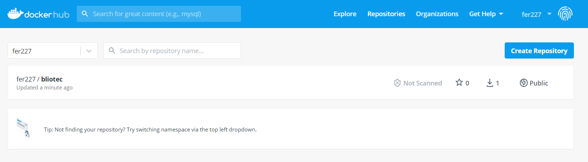
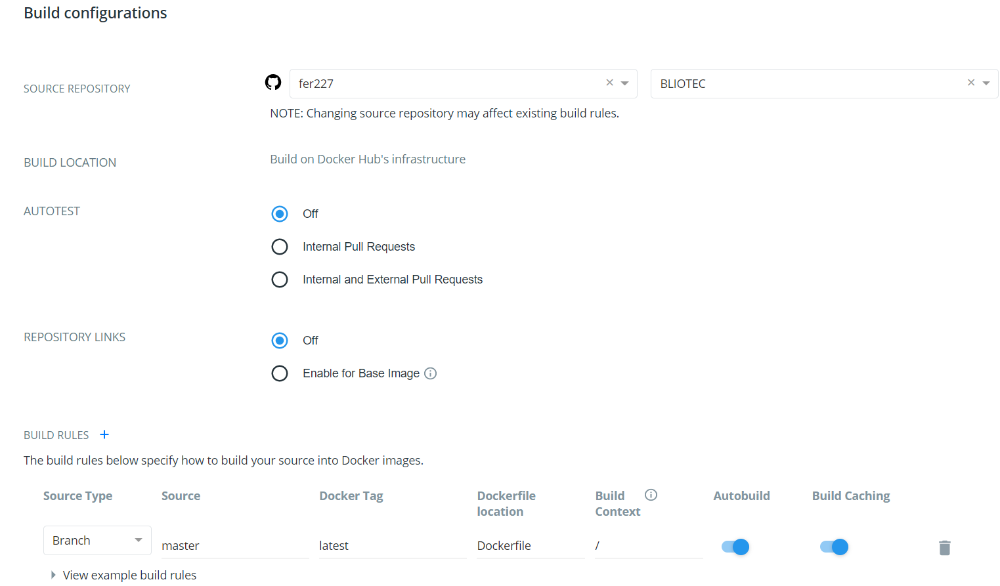
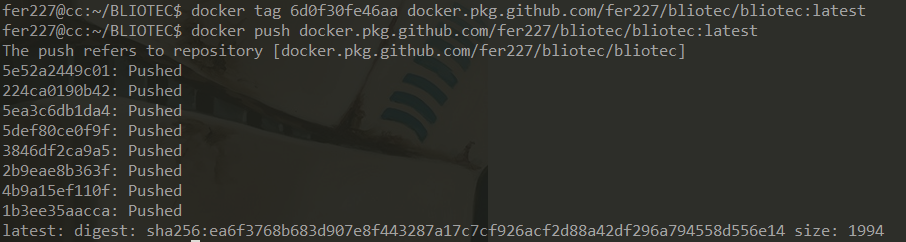

### Docker hub
Una vez tenemos la imagen creada y funcionando, sería interesante almacenarla en un repositorio público. Para ello disponemos de *Docker hub*. Primero nos creamos una cuenta en Docker hub y la enlazamos con nuestra cuenta de Github:

A continuación publicamos la imagen. Primero tenemos que ponerle un *tag* a la imagen, identificada por un ID.

Ahora podemos ver en nuestros repositorios de Docker hub que tenemos uno nuevo con una imagen. [Aquí](https://hub.docker.com/repository/docker/fer227/bliotec) puedes ver su vista pública.

Ahora procedemos a automatizar el proceso de creación de imágenes para cada *push* que hagamos en nuestro repositorio. Accedemos al apartado *builds* de la imagen, seleccionamos Github como proveedor y dejamos la siguiente configuración:

Podemos ver que ahora aparece como automatizado (*Autobuild*).

### Registro alternativo: GitHub Container Registry
Para utilizar el registro de Github Container he seguido el siguiente [tutorial](https://docs.github.com/es/free-pro-team@latest/packages/using-github-packages-with-your-projects-ecosystem/configuring-docker-for-use-with-github-packages). Una vez hemos generado el token, iniciamos sesión como se indica en el tutorial:

Una vez identificados, publicamos la imagen:

Y ya podemos ver en la página de nuestro propio repositorio como aparece la nueva imagen. Se puede ver [aquí](https://github.com/fer227/BLIOTEC/packages/513267).

