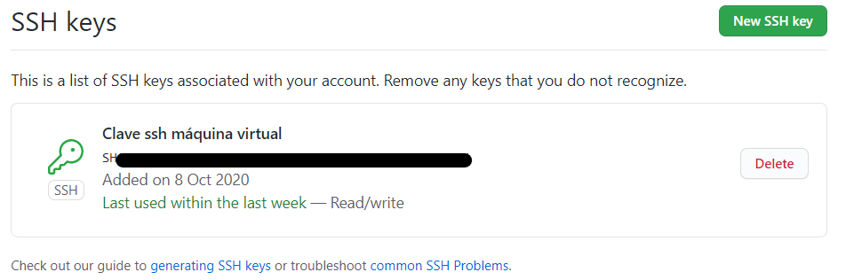

# Configuración de git

## Clave pública y privada
Github nos enseña en esta [guía](https://docs.github.com/es/free-pro-team@latest/github/authenticating-to-github/connecting-to-github-with-ssh) cómo generar las claves y asociarlas a nuestro Github.

## Activación del two-factor authentication

## Configuración correcta del perfil

## Creación de los tres repositorios de trabajo
[Repositorio forked](https://github.com/fer227/CC-20-21)

[Repositorio del proyecto](https://github.com/fer227/PROYECTO-CC)

[Repositorio de ejercicios](https://github.com/fer227/CC-evaluaciones)

## Realización de los ejercicios de la primera autoevaluación
[Ejercicios](https://github.com/fer227/CC-evaluaciones/blob/main/ev_01.md)