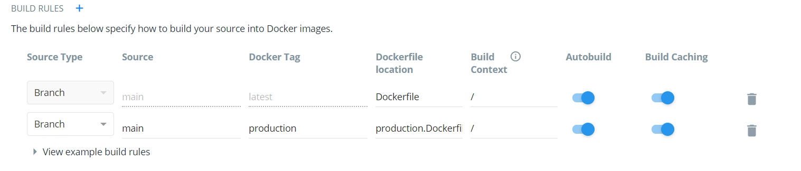

## Errores diseñados y excepciones
Para controlar los posibles errores que surgan en la aplicación, he decido crear una excepción genérica que se compone de un nombre para identificar el "tipo" de excepción que puede ser y un mensaje informativo. La excepción se define como una función en [exception.js](../../src/exception/exception.js):

```
function Exception(name, msg){
    this.name = name;
    this.msg = msg;
}
```

De esta forma, podemos lanzar la excepción en los controladores, se captura en los *routers* (donde se definen las diferentes rutas, en nuestro caso se encuentran en la carpeta [routes](../../routes)) y así podemos lanzar un código de error acorde.

He decidido establecer tres tipos de excepciones:
- **NotFound**. Para cuando estamos especificando una operación sobre un recurso (por ejemplo, el identificador de un libro) y ese recurso no existe. En ese caso lanzaremos un 404.
- **AlreadyExists**. Para cuando intentamos crear un recurso pero el identificador del mismo (por ejemplo, el *username* de un usuario) ya está asignado y por lo tanto, no está disponible. En ese caso lanzaremos un 409.
- **BadFormat**. Cuando los parámetros de la petición que estamos haciendo no son correctos. En este caso lanzaremos un código 400.

De acuerdo a esas especificaciones, he diseñado una función para manejar las excepciones que se puede encontrar en [exceptionHandler.js](../../routes/exceptionHandler.js) y muestro a continuación:

```
function exceptionHandler(ctx, exception){
    if(exception.name == "NotFound"){
        ctx.status = 404;
    }
    else if(exception.name == "AlreadyExists"){
        ctx.status = 409;
    }
    else if(exception.name == "BadFormat"){
        ctx.status = 400;
    }
    ctx.body = {msg : exception.msg};
    ctx.log.error(exception.msg);
}
```

1. Pasamos por parámetro el contexto de la petición junto con la excepción.
2. Comprobamos el nombre para asignar el *status* adecuado.
3. Incluimos el mensaje informativo en la respuesta y registramos el error en el *logger*.

De esta forma pretendemos la unificación del tratamiento de errores, además de la reducción de código.

Algunas referencias en los códigos de errores:
- [HTTP Status Code for username already exists when registering new account (stackoverflow)](https://stackoverflow.com/questions/26587082/http-status-code-for-username-already-exists-when-registering-new-account/53341561)
- [HTTP response code for POST when resource already exists (stackoverflow)](https://stackoverflow.com/questions/3825990/http-response-code-for-post-when-resource-already-exists)

## Github Action
Decidí añadir una Github Action para lanzar test. De esta forma aprendemos a utilizar un nuevo sistema de integración continua que me ha resultado bastante rápido y eficaz. La Github Action se puede ver a continuación.

```
name: test

# Controls when the action will run. 
on:
  # Triggers the workflow on push or pull request events but only for the main branch
  push:
    branches: [ main ]

  # Allows you to run this workflow manually from the Actions tab
  workflow_dispatch:

# A workflow run is made up of one or more jobs that can run sequentially or in parallel
jobs:
  testear:
    runs-on: ubuntu-latest

    # Steps represent a sequence of tasks that will be executed as part of the job
    steps:
      # Checks-out your repository under $GITHUB_WORKSPACE, so your job can access it
      - uses: actions/checkout@v2

      - name: comprobar montaje
        run: ls -la

      - name: lanzar test
        run: |
          docker run -t -v `pwd`:/app/test fer227/bliotec

      - name: lanzar pruebas y gestor de tareas
        run: |
          docker run -t -v `pwd`:/app/test fer227/bliotec sh -c "ls -la && pwd && whoami && gulp install && gulp build && gulp test"

```

## Docker de despliegue
Se ha llevado a cabo el Dockerfile de despliegue, el cual se muestro seguidamente.

```
FROM node:14-alpine3.10
LABEL maintainer ="Fernando Izquierdo Romera <fer227@correo.ugr.es>" \
        com.bliotec.version="4.0.0" \
        com.bliotec.release-date="2021-01-11" \
        com.bliotec.repository="https://github.com/fer227/BLIOTEC"

RUN mkdir -p /app && chown -R node /app

WORKDIR /app

COPY --chown=node  package*.json gulpfile.js ./
COPY --chown=node  ./index.js ./
COPY --chown=node  src ./src
COPY --chown=node  routes ./routes

RUN npm install -g gulp-cli && npm link gulp && npm install gulp-run

USER node

RUN gulp install

ENV PATH=/app/node_modules/.bin:$PATH

# Exponemos el puerto 6000 donde responde el microservicio
EXPOSE 6000

# Llamamos a la tarea que lanza los test
CMD ["gulp", "run"]
```


También se ha automatizado su construcción en Docker Hub.


