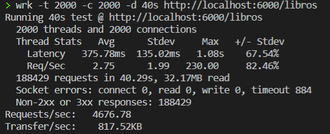
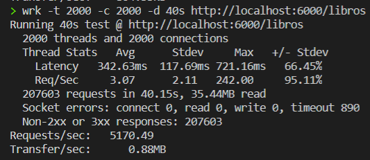

# Elección del framework
Para crear un microservicio necesitaremos crear una serie de rutas que den respuesta a las necesidades de los clientes. Los frameworks nos facilitarán la construcción de las mismas. Para el lenguaje que estamos utilizando en nuestro proyecto existen multitud de frameworks, aunque el funcionamiento de los mismos es bastante similar en todos ellos.

El más estandarizado y con más soporte es *Express*. De hecho, la mayoría del resto de frameworks intenta imitar su filosofía. Por otro lado, también es cierto que al ser un framework tan completo, hace que dependa de muchos módulos y sea un tanto [pesado](https://medium.com/sharenowtech/there-are-expressjs-alternatives-590d14c58c1c). 

Es por esto que he decido fijarme en otro tipo de frameworks, más "ligeros" y minimalistas (también se conocen como microframeworks) que probablemente tengan un buen rendimiento. También porque el único que he probado previamente es Express y me gustaría probar otros diferentes.

Los dos framework que se han probado han sido *Polka* y *Koa*. Para ambos, implementamos las rutas del controlador de libros para ver su sintaxis y funcionamiento.

- **Polka**. En el estado del proyecto de este [commit](https://github.com/fer227/BLIOTEC/tree/05d79c0652b408a1eb72e96afd119b334f667e1b), concretamente en el [index.js](https://github.com/fer227/BLIOTEC/blob/05d79c0652b408a1eb72e96afd119b334f667e1b/index.js) se puede ver como se implementaron algunas rutas del controlador de libros. La documentación de este framework se puede ver [aquí](https://github.com/lukeed/polka).
- **Koa**. Para comparar con el anterior, se realizó la misma tarea que se puede observar en el estado del proyecto de este [commit](https://github.com/fer227/BLIOTEC/tree/bda29334409e7eda90bba459f77e780ccabe69e9) y concretamente en su [index.js](https://github.com/fer227/BLIOTEC/blob/bda29334409e7eda90bba459f77e780ccabe69e9/index.js). La documentación de este framework se puede ver [aquí](https://github.com/koajs/koa).

## Diferencias
- Con respecto al formato de las peticiones y respuestas, *Polka* sigue la sintaxis de Express teniendo un objeto con la información de la petición y otro para la respuesta que podemos modificar (req, res). En el caso de Koa, lo tenemos todo englobado en un objeto que se conoce como el "contexto" (ctx).
- Podemos observar que en Polka no existe una diferenciación entre el *router* que gestiona las rutas y la aplicación o servidor (las rutas cuelgan directamente de la aplicación). En el caso de Koa, si tenemos un módulo (no viene en el *core* del framework) para crear un *router* y gestionar las rutas.
- En el *router* de Koa, contamos con un método *allowedMethods()* que permitirá a la aplicación detectar qué métodos y qué rutas están definidas para lanzar el error correspondiente en caso de que el cliente se salga de las rutas establecidas.
- En general, Koa tiene más soporte (pues tiene una mayor comunidad) y cuenta con *plugins* (body-parsers, json, loggers...) específicos para el framework, cosa que no ocurre en Polka.
- En cuanto al rendimiento, se han hecho unas pequeñas pruebas de benchmarking mediante la herramienta *wrk*. En general, el rendimiento de ambos fue bastante parecido en las ejecuciones llevadas a cabo. A continuación mostramos un ejemplo.
    - Koa:
        - 
    - Polka:
        - 

## Conclusiones y elección
**Polka** es un microframework que nos permite desarrollar aplicaciones de forma muy rápida debido a su diseño minimalista. En su documentación, también lo comparan en Benchmarks con otros frameworks (como Koa y Express) y aparece como el más eficiente.

Sin embargo, creo que la diferenciación del *router* con la aplicación, el soporte mediante plugins, la mayor comunidad y en general el funcionamiento de **Koa** lo hacen una opción más completa e interesante para nuestro proyecto.

