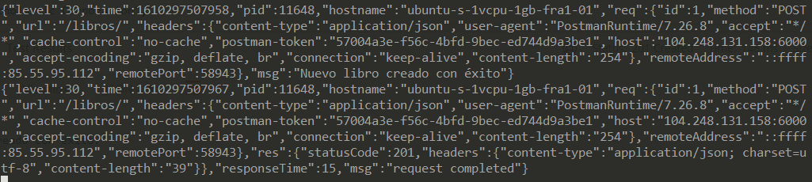
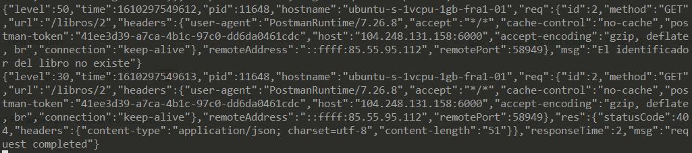

## Buenas prácticas

### Configuración de los *logs*

En cualquier microservicio es imprescindible el uso de *logs* para tener un historial de lo que ocurre en nuestra aplicación. Para nuestro lenguaje encontramos muchos y muy variados como Winston, loglevel, Pino o Morgan. 

Para nuestra aplicación creo que el más indicado es Pino pues cuenta con una versión específica para utilizar con Koa ([koa-pino-logger](https://www.npmjs.com/package/koa-pino-logger)). En su documentación aparece como el más eficiente frente a otras opciones. La característica que me ha hecho decidirme por él es que es muy sencillo de utilizar, pues se incorpora como una simple extensión del objeto "contexto" (*ctx*) de las peticiones a la API, lo que aclara bastante el código. A continuación mostramos un ejemplo:

```
ctx.status = 200;
ctx.body = libro;
ctx.log.info('Libro concreto obtenido correctamente');
```

Podemos añadir información (*.info*) o indicar que es un error (*.error*), lo que modificará el nivel de prioridad del *log*. Seguidamente muestro una captura de la información que recoge el log (de una petición correcta y otra que resultó en error).





### Configuración distribuida
Para ello utilizamos *etcd3* y en caso de falla, leemos la información de un *.env*. Por el momento, solo necesitamos guardar el puerto. El código relacionado con esto se encuentra en el [index.js](../../index.js). Básicamente contamos con una función *getEnvironment*:

```
async function getEnvironment(){
    port = await etcd.get("port").string()
    .then(()=>{
        port = parseInt(port);
    }).catch((err)=>{
        port = process.env.PORT || 6000;
        return port;
    });
}
```

Esta función intenta obtener el puerto en *etcd* mediante la clave *port*. Como hemos comentado anteriormente, en caso de fallo, detecta la excepción y lo leemos del *.env* mediante *dotenv*.

### Estructuración de la API
Como tenemos tres controladores diferenciados, se ha desarrollado un router para cada uno de ellos (en el directorio [routes](../../routes) se pueden ver los tres ficheros diferenciados). Luego en el [index](../../index.js), cada router aporta sus rutas y métodos disponibles:

```
app.use(libros.routes());
app.use(libros.allowedMethods());
app.use(prestamos.routes());
app.use(prestamos.allowedMethods());
app.use(usuarios.routes());
app.use(usuarios.allowedMethods());
```
